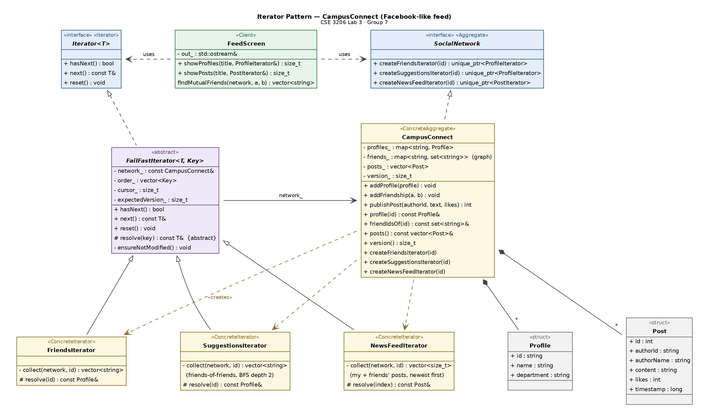
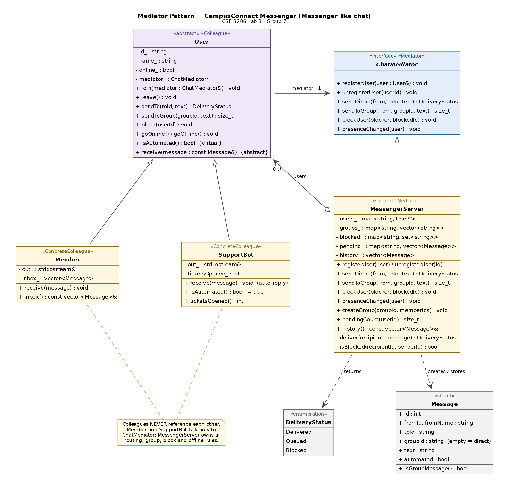

# CampusConnect — Iterator & Mediator Design Patterns (C++17)

[](https://github.com/Kafi2611/CSE3206-Group7-Iterator-Mediator/actions/workflows/ci.yml)

**CSE 3206 – Software Engineering Sessional · Lab 3: Design Pattern Analysis, Implementation and Code Review**
Rajshahi University of Engineering & Technology (RUET) · Department of CSE · **Presentation Group 7**

| Name | Student ID | GitHub |
|---|---|---|
| Abdullah Al Kafi (Group Leader) | 2203139 | [@Kafi2611](https://github.com/Kafi2611) |
| Sadaf Rahman | 2203140 | [@sadaf532](https://github.com/sadaf532) |
| Sakila Akter | 2203141 | [@SakilaAkter](https://github.com/SakilaAkter) |

---

## What is this?

**CampusConnect** is a small console-based social platform for RUET students, built to demonstrate our two assigned **behavioral** design patterns:

| Module | Inspired by | Pattern | What it shows |
|---|---|---|---|
| `iterator/` – CampusConnect Feed | Facebook | **Iterator** | Friends list, *People You May Know* and a News Feed are walked with **one** interface (`hasNext()`, `next()`, `reset()`), even though the data lives in a map, a friendship graph and a vector. |
| `mediator/` – CampusConnect Messenger | Messenger | **Mediator** | Users never talk to each other directly. A central `MessengerServer` owns every rule: direct messages, group chats, blocking, offline delivery and a help-desk bot. |

## Quick start

**Windows** (needs `g++` from MinGW-w64 / MSYS2 / Code::Blocks in `PATH`):

```bat
build.bat          :: build everything into bin\ and run all unit tests
build.bat run      :: ...then run both demos
```

**Linux / macOS / Git Bash:**

```bash
./build.sh run
```

**Any IDE with CMake** (CLion, VS Code, Visual Studio):

```bash
cmake -S . -B build
cmake --build build
ctest --test-dir build --output-on-failure
./build/iterator_demo
./build/mediator_demo
```

## Sample output

```text
==== 2. SuggestionsIterator: People You May Know ====
Suggested for Kafi (most mutual friends first):
  1. Rafi Hasan (@rafi, EEE)
  2. Nusrat Jahan (@nusrat, ME)

==== 3. Offline delivery: the server queues the message ====
  Kafi -> Sakila  ->  Queued (recipient offline)
  Messages waiting for Sakila: 1
  Sakila comes online...
    [Sakila's phone] Kafi: Presentation practice at 8 PM?
```

## UML class diagrams

**Iterator — CampusConnect Feed**



**Mediator — CampusConnect Messenger**



Sequence and "before vs after" diagrams are in [`docs/uml/`](docs/uml). Diagram sources (Graphviz `.dot` + Python generators) are in [`docs/uml/source/`](docs/uml/source).

## Pattern participants

| GoF role | Iterator module | Mediator module |
|---|---|---|
| Interface | `Iterator<T>` | `ChatMediator` |
| Concrete | `FriendsIterator`, `SuggestionsIterator`, `NewsFeedIterator` | `MessengerServer` |
| Aggregate / Colleague | `SocialNetwork` → `CampusConnect` | `User` → `Member`, `SupportBot` |
| Client | `FeedScreen`, `findMutualFriends()` | `main()` |

## Project structure

```text
.
├── iterator/            Iterator pattern  (include/, src/, main.cpp)
├── mediator/            Mediator pattern  (include/, src/, main.cpp)
├── tests/               33 unit tests + tiny test framework (no external libs)
├── docs/                Lab documentation, code review report, UML diagrams
├── .github/workflows/   CI: build + test on every push / pull request
├── CMakeLists.txt       modules are optional, so each part builds on its own
├── build.bat / build.sh one-click build + test
└── GITHUB_GUIDE.md      how our team uses Git and GitHub
```

## Documentation

- [Lab Lecture Documentation (PDF)](docs/Group7_Lab3_Documentation.pdf) — the 15-section format for both patterns
- [Code Review Report (PDF)](docs/Group7_Code_Review_Report.pdf) — checklist review, findings log, test report
- [GitHub guide for the team](GITHUB_GUIDE.md)

## Quality

- **33 unit tests** (16 Iterator + 17 Mediator), all passing; ~99 % line coverage of the module sources
- **0 warnings** on GCC 13 and Clang 18 with `-Wall -Wextra -Wpedantic -Wshadow -Wconversion`
- clang-tidy reviewed; AddressSanitizer, UndefinedBehaviorSanitizer and Valgrind clean
- GitHub Actions CI on every push and pull request

## Team contributions

| Member | Main work |
|---|---|
| Abdullah Al Kafi | Architecture, Iterator module, build system & CI, repository owner, presentation lead |
| Sadaf Rahman | Mediator module, Mediator UML diagrams |
| Sakila Akter | Unit tests, lab documentation, code review report |

---
*Academic project for CSE 3206, RUET. "Facebook" and "Messenger" are mentioned only to describe the kind of application; CampusConnect is an independent student project.*
